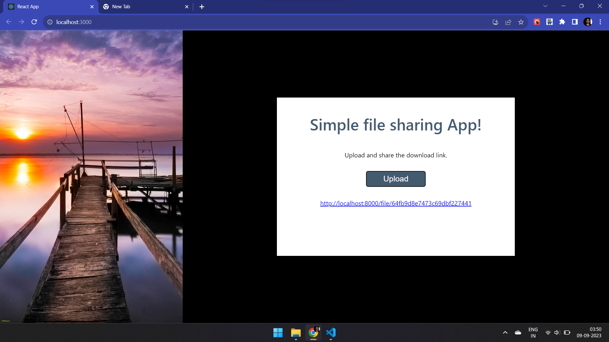

# File Sharing App

## Overview
The File Sharing App is a versatile platform that simplifies the process of sharing files with others. Whether it's images, PDFs, or any other file type, this application allows users to upload files and generates unique download links for easy sharing. Built using the MERN (MongoDB, Express, React, Node.js) stack and integrated with MongoDB Atlas, this full-stack project ensures secure and efficient file sharing.

## Getting Started
Follow these steps to set up and run the File Sharing App on your local machine:

->Clone the Repository: Start by cloning this repository to your local environment.

->Create .env File: In the server directory, create a .env file and add the following details:

PORT=8000
DB_USERNAME=your_username
DB_PASSWORD=your_password
Replace your_username and your_password with your MongoDB Atlas cluster project credentials.

->Install Dependencies: Run npm install in both the server and client directories separately to install the necessary dependencies.

->Start the Server and Client: In two different terminals, execute the following commands:

(Navigate to the client directory) Start the client: npm start
(Navigate to the server directory) Start the server: npm start
Upload and Share: Once the client and server are running, you can start using the app. Upload your desired files, and the app will generate unique shareable links for each file.

## Contributions
Contributions to this project are welcome! If you have ideas for improvements or new features, feel free to create a pull request. Please follow the contributing guidelines for smooth collaboration.

## License
This project is licensed under the MIT License. You can find the details in the LICENSE file.

Thank you for using the File Sharing App! Hope it streamlines your file-sharing requirements.